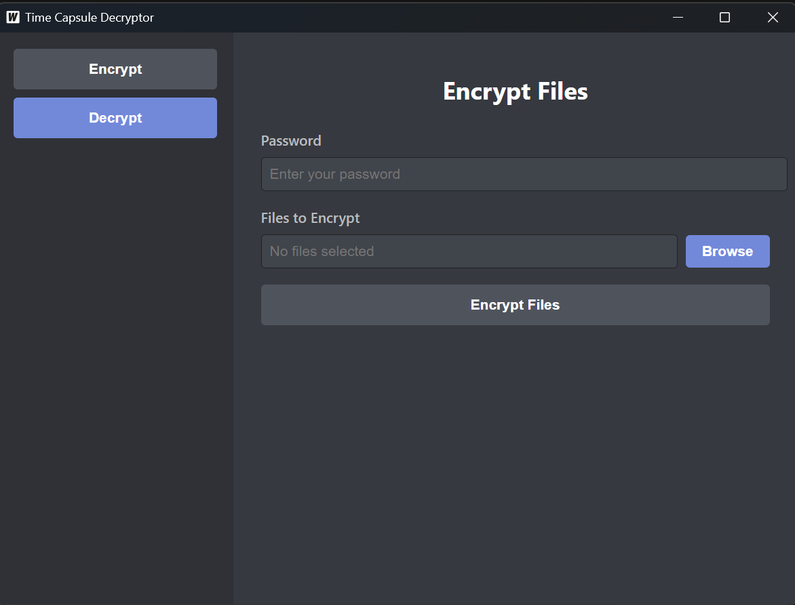
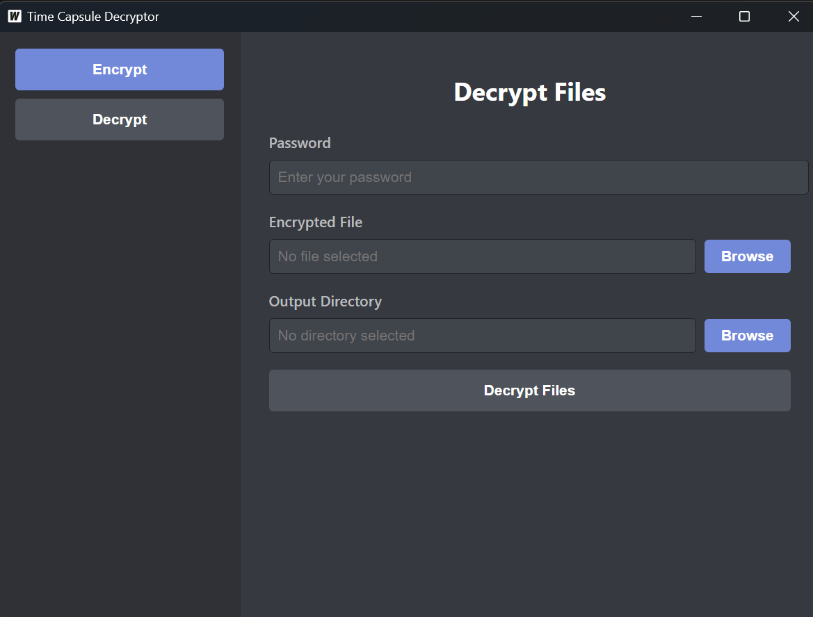

# 🚀 File Encryption and Decryption App

  
  
  


A simple and secure desktop application built with **Wails** (Go + React) for encrypting and decrypting files. Perfect for protecting sensitive data with a user-friendly interface.

---

## 📋 Features

- **🔒 File Encryption**: Encrypt one or more files with a password.
- **🔓 File Decryption**: Decrypt files using the correct password.
- **🖥️ Cross-Platform**: Works on Windows, macOS, and Linux.
- **🎨 Clean UI**: Built with React for a modern and responsive experience.

---

## 🛠️ Technologies Used

- **Frontend**: React (with React Router for navigation)
- **Backend**: Go (for encryption/decryption logic)
- **Framework**: Wails (for building desktop apps with Go and React)
- **Styling**: Plain CSS

---

## 🎨 Screenshots

### 🔐 Encrypt Page



### 🔓 Decrypt Page



---

## 🛠️ Installation

### Option 1: Precompiled Binary

Download the executable: **[Desktop.exe](./build/bin/Desktop.exe)**

### Option 2: Build From Source

Follow these steps to clone and build the app locally:

```bash
# Clone the repository
git clone https://github.com/Siarhii/A-simple-File-Decrypter-and-Encrypter.git

# Navigate into the project folder
cd A-simple-File-Decrypter-and-Encrypter

# Install frontend dependencies
cd frontend
npm install

# Build the app (requires Go and Wails)
wails build

# Run the application
./build/bin/Desktop.exe

```

## 💡 Usage

## 🔐 Encrypt Files

    Open the app and navigate to the Encrypt tab.

    Enter a password.

    Select one or more files to encrypt.

    Click Encrypt Files to start the process.

## 🔓 Decrypt Files

Open the app and navigate to the Decrypt tab.

Enter the password used during encryption.

Select the encrypted file.

Choose an output directory for the decrypted files.

Click Decrypt Files to start the process.

---

## 🛡️ Security

Password Protection: Files are encrypted with a user-provided password.

Local Processing: All encryption/decryption happens locally on your machine.

---

### 👥 Contributors

- **[Siarhii](https://github.com/Siarhii)** - Developer

---

### 📜 License

This project is licensed under the **MIT License** - see the [LICENSE](LICENSE) file for details.

---

### 🤝 Contributing

Contributions, issues, and feature requests are welcome!  
Feel free to check the [issues page](https://github.com/Siarhii/Remote-thing/issues).

---

### 🌟 Show Your Support

If you like this project, **give it a ⭐️** and share it with others!
